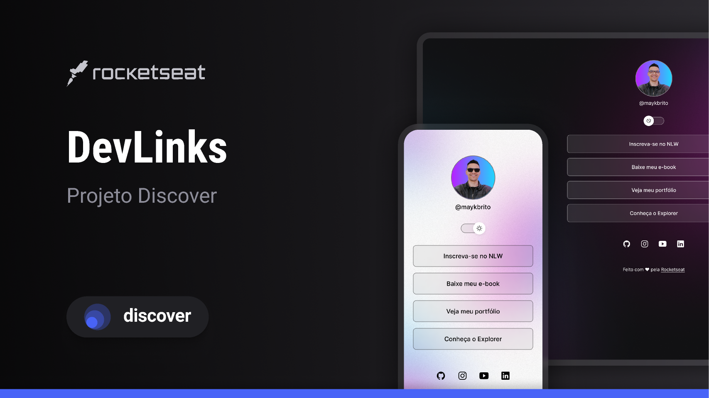

Fala, Dev!

Seja bem vindo(a)

<h1 align="center">DevLinks</h1>
<h3 align="center">Projeto Trilha Discover - Rocketseat</h3>

Programa exclusivo e gratuito, produzido pela Rocketseat, com os primeiros passos para tecnologias WEB.  
<a href="https://www.rocketseat.com.br/">Estude esse projeto em formato de vídeo, saiba mais clicando aqui.</a>

  <a href="#-sobre">Sobre</a>   |   
  <a href="#-tecnologias">Tecnologias</a>   |   
  <a href="#-layout">Layout</a>   |   
  <a href="#-considerações">Considerações</a>   |   
  <a href="#-licença">Licença</a>

  

 

<h3>📌 Sobre</h3>

O DevLinks é um agregador de links para usar como cartão de visitas online!

<h3>📌 Tecnologias</h3>

- HTML
- CSS
- JavaScript;
- Git e Github;
- Figma;

<h3>📌 Layout</h3>

Você pode visualizar o layout do projeto através [DESSE LINK](https://www.figma.com/community/file/1187422022288947321). É necessário ter conta no [Figma](https://figma.com) para acessá-lo.

<h3>📌 Considerações</h3>

O projeto foi um inicio para obtenção de conhecimentos, e de testar minhas habilidades, para saber se estou pronto próximo nível.

<h3>📌 Licença</h3>

Esse projeto está sob a licença MIT.
